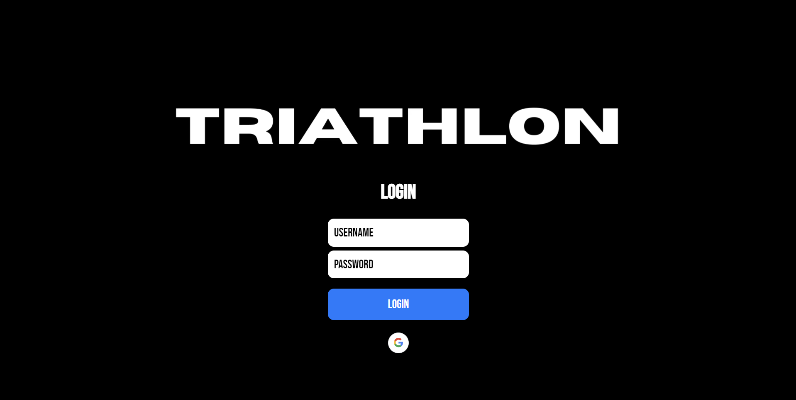
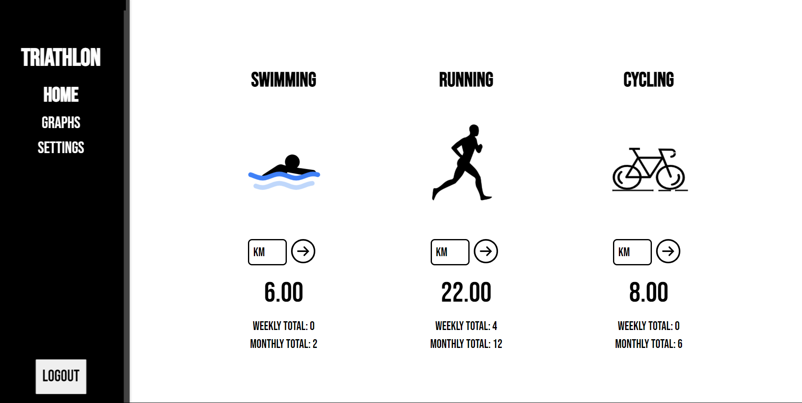
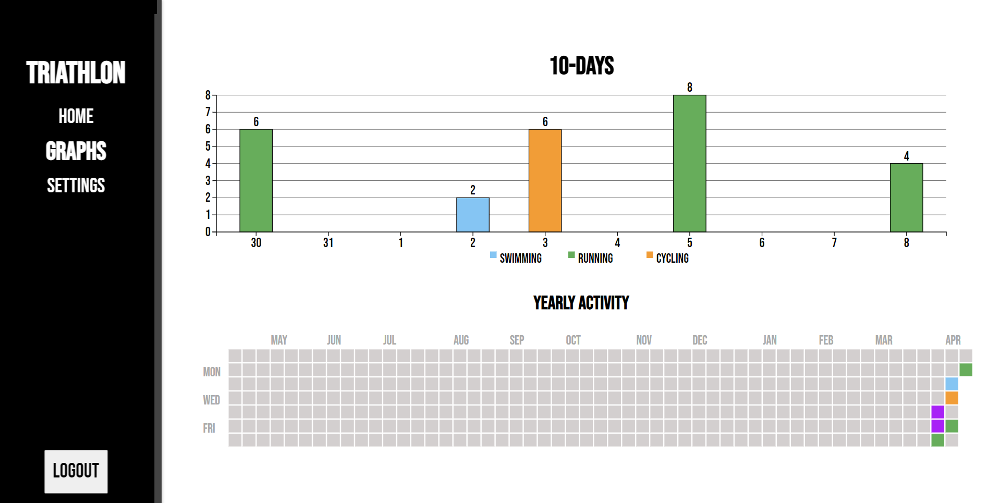

A full stack project to make an activity tracker using the MERN-stack. The app has a functioning database for login authentication and user activity data.
The app includes an animated home page and an animated graph page, for displaying the users acitivies.

## Available Scripts

In the project directory, you can run:

### `npm start`

Runs the app in the development mode.\
Open [http://localhost:3000](http://localhost:3000) to view it in your browser.
